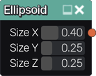

Ellipsoid node
~~~~~~~~~~~~~~

The **Ellipsoid** node generates a 3d signed distance function for an ellipsoid.

Inputs
++++++

The **Ellipsoid** node does not accept any input.

Outputs
+++++++

The **Ellipsoid** node generates a signed distance function for an ellipsoid.

Parameters
++++++++++

The **Ellipsoid** node accepts the following parameters:

* **X** , **Y** and **Z** sizes of the ellipsoid

Example images
++++++++++++++

