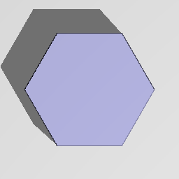

Hexagonal Prism node
....................

The **Link** node generates a 3d signed distance function for a hexagonal prism.

.. image:: images/node_3d_sdf_shapes_hex_prism.png
	:align: center

Inputs
::::::

The **Hexagonal Prism** node does not accept any input.

Outputs
:::::::

The **Hexagonal Prism** node generates a signed distance function for a hexagonal prism.

Parameters
::::::::::

The **Hexagonal Prism** node accepts **Radius** and **Height** of the hexagonal prism as parameters.

Example images
::::::::::::::

