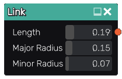

Link node
.........

The **Link** node generates a 3d signed distance function for a link.

Inputs
::::::

The **Link** node does not accept any input.

Outputs
:::::::

The **Link** node generates a signed distance function for a link.

Parameters
::::::::::

The **Link** node accepts the following parameters:

* The **Length** of the link.

* The **Major Raidus** and **Minor Radius** of the link.

Example images
::::::::::::::

