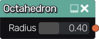

Octahedron node
~~~~~~~~~~~~~~~

The **Octahedron** node generates a 3d signed distance function for an octahedron.

Inputs
++++++

The **Octahedron** node does not accept any input.

Outputs
+++++++

The **Octahedron** node generates a signed distance function for an octahedron.

Parameters
++++++++++

The **Octahedron** node accepts a single parameter, its radius.

Example images
++++++++++++++

