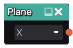

Plane node
..........

The **Plane** node generates a 3d signed distance function for a plane.
It has little use on its own and will generatty be used to cut or intersect other shapes.

Inputs
::::::

The **Plane** node does not accept any input.

Outputs
:::::::

The **Plane** node generates a signed distance function for a plane.

Parameters
::::::::::

The **Plane** node accepts as parameter the axis of the plane.
