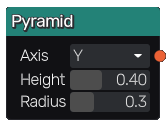
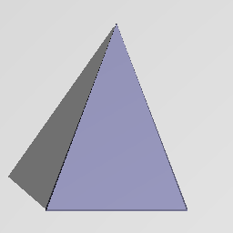

Pyramid node
~~~~~~~~~~~~

The **Torus** node generates a 3d signed distance function for a pyramid.

Inputs
++++++

The **Pyramid** node does not accept any input.

Outputs
+++++++

The **Pyramid** node generates a signed distance function for a pyramid.

Parameters
++++++++++

The **Pyramid** node accepts the following parameters:

* **Axis** of the pyramid

* **Height** of the pyramid

* Base **Radius** of the pyramid

Example images
++++++++++++++

