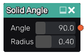
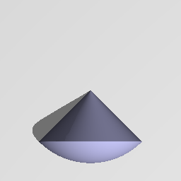

Solid Angle node
................

The **Solid Angle** node generates a 3d signed distance function for a solid angle.

Inputs
::::::

The **Solid Angle** node does not accept any input.

Outputs
:::::::

The **Solid Angle** node generates a signed distance function for a solid angle.

Parameters
::::::::::

The **Solid Angle** node accepts the following parameters:

* The **Angle** of the solid angle's apex.

* The **Radius** of the sphere that houses the solid angle.

Example images
::::::::::::::

