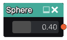

Sphere node
...........

The **Sphere** node generates a 3d signed distance function for a sphere.

Inputs
::::::

The **Sphere** node does not accept any input.

Outputs
:::::::

The **Sphere** node generates a signed distance function for a sphere.

Parameters
::::::::::

The **Sphere** node accepts a single parameter, its radius.

Example images
::::::::::::::

