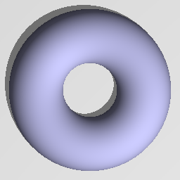

Torus node
..........

The **Torus** node generates a 3d signed distance function for a torus.

.. image:: images/node_sdf3d_torus.png
	:align: center

Inputs
::::::

The **Torus** node does not accept any input.

Outputs
:::::::

The **Torus** node generates a signed distance function for a torus.

Parameters
::::::::::

The **Torus** node accepts as parameters both radiuses of the torus.

Example images
::::::::::::::

