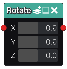

Rotate node
...........

The **Rotate** node is variadic and generates 3D signed distance functions of rotated scenes
based on its inputs. If the input shapes are associated to color indexes, the
rotate node applies them to the outputs.

Inputs
::::::

The **Rotate** node accepts one or more inputs in 3D signed distance function format.

Outputs
:::::::

The **Rotate** node generates signed distance functions of the
rotated input shapes.

Parameters
::::::::::

The **Rotate** node accepts *the angles of the rotations around the X, Y and Z axes* as parameters.
