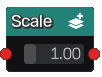

Scale node
..........

The **Scale** node is variadic generates 3D signed distance functions of scaled shapes
based on its inputs. If the input shapes are associated to color indexes, the
scale node applies them to the output.

Inputs
::::::

The **Scale** node accepts one or more inputs in 3D signed distance function format.

Outputs
:::::::

The **Scale** node generates signed distance functions of the
scaled input shapes.

Parameters
::::::::::

The **Scale** node accepts *its scale factor* as parameters.
