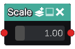

Scale node
..........

The **Scale** node generates a 3D signed distance function of a scaled shape
based on its input. If the input shapes are associated to color indexes, the
scale node applies them to the output.

Inputs
::::::

The **Scale** node accepts an input in 3D signed distance function format.

Outputs
:::::::

The **Scale** node generates a signed distance function of the
scaled input shape.

Parameters
::::::::::

The **Scale** node accepts *its scale factor* as parameters.
