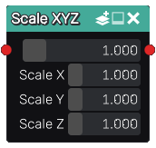

Scale XYZ node
..............

The **Scale XYZ** node is variadic and generates 3D signed distance functions of scaled shapes
based on its inputs in a non uniform way. 
The result shapes are no longer correct signed distance functions, but can be used for many operations like ray marching.

Inputs
::::::

The **Scale XYZ** node accepts an input in 3D signed distance function format.

Outputs
:::::::

The **Scale XYZ** node generates a signed distance function of the
scaled input shape.

Parameters
::::::::::

The **Scale XYZ** node has four parameters:

* The *Scale* used as a uniform scale factor.

* The *Scale X* parameter defines the scale ratio along the X axis.

* The *Scale Y* parameter defines the scale ratio along the Y axis.

* The *Scale Z* parameter defines the scale ratio along the Z axis.