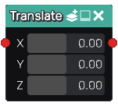

Translate node
..............

The **Translate** node is variadic and generates 3D signed distance functiosn of translated shapes
based on its inputs. If the input shapes are associated to color indexes, the
translate node applies them to the output.

Inputs
::::::

The **Translate** node accepts one or more inputs in 3D signed distance function format.

Outputs
:::::::

The **Translate** node generates signed distance functions of the
translated input shapes.

Parameters
::::::::::

The **Translate** node accepts *the X, Y and Z components of the translation* as parameters.
