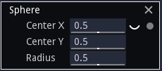

Sphere node
~~~~~~~~~~~

The **Sphere** node outputs a grayscale image that represents the depth of a 3D sphere.

Inputs
++++++

The **Sphere** node does not accept any input.

Outputs
+++++++

The **Sphere** node provides an output that generates a grayscale image showing the
selected 3D sphere.

Parameters
++++++++++

The **Sphere** node accepts the *sphere center position* as X and Y coordinates
and its *radius* as parameters. 

Example images
++++++++++++++

.. image:: images/node_3d_sphere_samples.png
	:align: center
