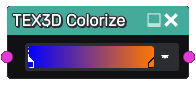

Colorize node
~~~~~~~~~~~~~

The **Colorize** node applies a user-defined gradient to a 3D texture: black pixels
will be colored with the leftmost color of the gradient and white pixels will take
the rightmost color.

Inputs
......

The **Colorize** node inputs a 3D texture and implicitely converts it to grayscale.

Outputs
.......

The **Colorize** node provides a single color 3D texture.

Parameters
..........

The **Colorize** node has a single parameter that defines the gradient to be applied to
the input texture.

Example images
..............

