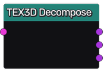

Decompose node
~~~~~~~~~~~~~~

The **Decompose** node decomposes a 3D texture into three grayscale 3D textures.

Inputs
++++++

The **Decompose** node has a single 3D texture input.

Outputs
+++++++

The **Decompose** node outputs three 3D grayscale textures , one for each (red, green, blue) channel.
