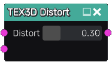

Distort node
~~~~~~~~~~~~

The **Distort** node distorts a 3D texture.

Inputs
......

The **Distort** node inputs a 3D texture to be distorted and a 3D textures whose R, G and B channels define the distortion alongall 3 axes.

Outputs
.......

The **Distort** node provides a distorted 3D texture.

Parameters
..........

The **Distort** node accepts a parameter that defines the strength of the distortion.

Example images
..............

