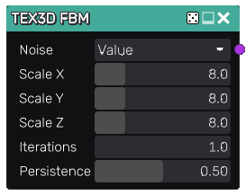

FBM node
~~~~~~~~

The **FBM** node outputs a 3D fractional Brownian motion texture.
FBM is obtained by repeating a noise pattern with smaller and smaller details.

Inputs
......

The **FBM** node does not accept any input.

Outputs
.......

The **FBM** node provides a greyscale 3D texture.

Parameters
..........

The FBM node accepts the following parameters:

* the noise type: value noise, fractal noise or cellular noise, and their non-repetitive counterparts
* the *X*, *Y* and *Z* scale of the first octave noise
* the number of iterations
* the persistance, i.e. the strength of each subsequent iteration

Example images
..............

