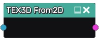

From2D node
~~~~~~~~~~~

The **From2D** node generates a 3D texture from a 2D texture by projecting it along the Z axis.

Inputs
......

The **From2D** node accepts a single 2D texture as input

Outputs
.......

The **From2D** node generates a 3D texture.

Parameters
..........

The **From2D** node does not accept any parameter.

Example images
..............

