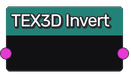
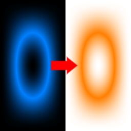

Invert node
~~~~~~~~~~~

The **Invert** node inverts the input 3D texture. The R, G and B channel are inverted.

Inputs
++++++

The **Invert** node requires a input 3D texture.

Outputs
+++++++

The **Invert** node provides a single 3D texture.

Parameters
++++++++++

The **Invert** node does not have any parameter.

Example images
++++++++++++++

