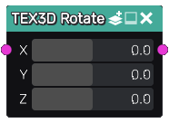

Rotate node
~~~~~~~~~~~

The **Rotate** node applies a rotation to a 3D texture.

Inputs
......

The **Rotate** node inputs a 3D texture.

Outputs
.......

The **Rotate** node provides a rotated 3D texture.

Parameters
..........

The **Rotate** node has a X, Y and Z parameters that define the rotations around each axis.

Example images
..............

