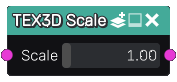
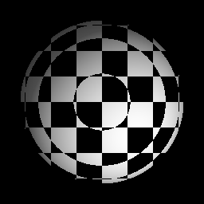

Scale node
~~~~~~~~~~

The **Scale** node is variadic and scales 3D textures.

Inputs
......

The **Scale** node inputs one or more 3D textures.

Outputs
.......

The **Scale** node provides scaled 3D textures.

Parameters
..........

The **Scale** node has X, Y and Z parameters that define the scaling on each axis.

Example images
..............

