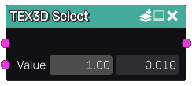

Select node
~~~~~~~~~~~

The **Select** node merges two 3D textures by assigning all samples to its first
input except those whose color index match the color parameter.

Inputs
......

The **Select** node accepts two 3D texture inputs:

* the default texture, used for all samples that don't match the color parameter
* the selected texture that is assigned to all samples that match

Outputs
.......

The **Select** node generates a merged 3D texture.

Parameters
..........

The **Select** node does accepts 2 parameters:

* a color index that is compared with the color index of each sample
* a tolerance value  used when comparing the color parameter with the sample's color index
