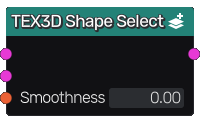

Shape Select node
~~~~~~~~~~~~~~~~~

The **Shape Select** node merges two 3D textures by assigning all samples to its first
input except those that are outside the input selection shape.

Inputs
......

The **Shape Select** node accepts two 3D texture inputs:

* the default texture, used for all samples that are inside the selection shape
* the selected texture that is assigned to all samples that are outside the selection shape
* the shape where the first input is applied

Outputs
.......

The **Shape Select** node generates a merged 3D texture.

Parameters
..........

The **Shape Select** node accepts a smoothness parameter that defines the width of the area
where both textures are mixed.
