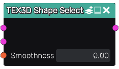

Shape Select node
~~~~~~~~~~~~~~~~~

The **Shape Select** merges two or more 3D textures by assigning
them based on input selection shapes

Inputs
......

The **Shape Select** node accepts two 3D texture inputs:

* The default texture, used for all samples that are outside the selection shape

* The selected texture that is assigned to all samples that are inside the selection shape

* The shape where the first input is applied

This node is variadic, and more inputs and associated selection shapes can be added.

Outputs
.......

The **Shape Select** node generates a merged 3D texture.

Parameters
..........

The **Shape Select** node accepts a smoothness parameter that defines the width of the area
where textures are mixed.
