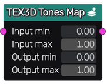

Tones Map node
~~~~~~~~~~~~~~

The **Tones Map** node is variadic and remaps 3D textures, given input and output tone intervals.
If necessary, the remap operation is extrapolated linearly beyond the specified intervals.

Inputs
++++++

The **Tones Map** node accepts one or more 3D input textures.

Outputs
+++++++

The **Tones Map** node outputs one or more 3D textures.

Parameters
++++++++++

The **Tones Map** node accepts 4 parameters:

* the minimum and maximum input tones

* the minimum and maximum output tones
