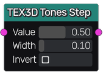

Tones Step node
~~~~~~~~~~~~~~~

The **Tones Step** node emphasizes the light and dark tones around a specified value.

Inputs
++++++

The **Tones Step** node requires a 3D input texture.

Outputs
+++++++

The **Tones Step** node provides a single 3D texture.

Parameters
++++++++++

The **Tones Step** node accepts 3 parameters:

* the *Value* around which the tones are emphasized

* the *Width* (in tones space) of the gradient between black and white areas

* the *Invert* option that will invert the result if checked
