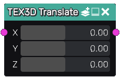

Translate node
~~~~~~~~~~~~~~

The **Translate** node is variadic and translates a 3D texture.

Inputs
......

The **Translate** node inputs one or more 3D textures.

Outputs
.......

The **Translate** node provides translated 3D textures.

Parameters
..........

The **Translate** node has a X, Y and Z parameters that define the translation around each axis.

Example images
..............

