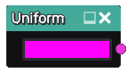

Uniform node
~~~~~~~~~~~~

The **Uniform** node outputs a single uniform 3d color texture
whose color is configurable.

Inputs
++++++

The uniform node does not accept any input.

Outputs
+++++++

The uniform node provides an output that generates a uniform 3d color texture.

Parameters
++++++++++

The **Uniform** node has a single *color* parameter that defines the color of
the output 3d texture.