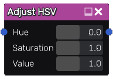

Adjust HSV node
~~~~~~~~~~~~~~~

The **Adjust HSV** node adjusts the hue, saturation and value of the input image.

Inputs
++++++

The **Adjust HSV** node requires a color input texture.

Outputs
+++++++

The **Adjust HSV** node provides a single color texture.

Parameters
++++++++++

The **Adjust HSV** node has the following parameters:

* *Hue* defines how hue is affected.

* *Saturation* defines how the colorfulness or the texture is affected.

* *Value* defines how the lightness is affected.

Example images
++++++++++++++

