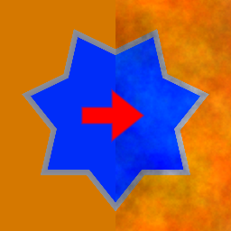

Alter HSV node
~~~~~~~~~~~~~

The **Alter HSV** node modifies the hue, saturation and value of the input image, according
to dedicated input maps. It can be used to easily apply variations to its input.

.. image:: images/node_filter_alterhsv.png
	:align: center

Inputs
++++++

The **Alter HSV** node requires a color input texture. It also has 3 greyscale input maps,
one for hue, one for value, and one for saturation. Values above 0.5 increase the associated
channel, and values below 0.5 decrease it.

Outputs
+++++++

The **Alter HSV** node provides a single color texture.

Parameters
++++++++++

The **Alter HSV** node has the following parameters:

* *All* is used as a multiplier for all input maps and can be used to modify the overall alteration
  intensity.

* *Hue* defines how hue is affected, and is used as a multiplier for the corresponding input map.

* *Value* defines how the lightness is affected, and is used as a multiplier
  for the corresponding input map.

* *Saturation* defines how the colorfulness or the texture is affected, and is used as a multiplier
  for the corresponding input map.

Example images
++++++++++++++

