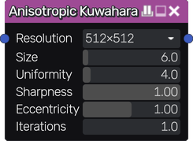
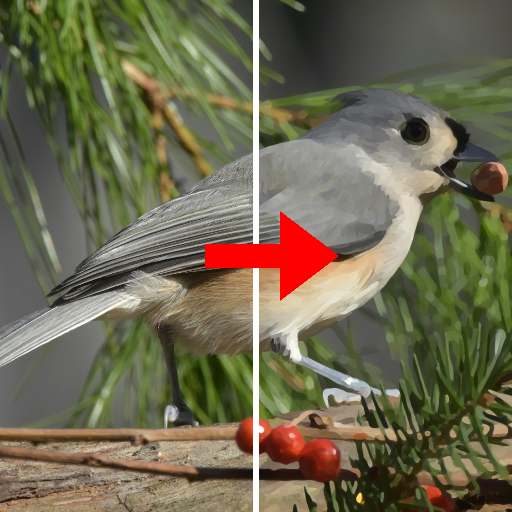

Anisotropic Kuwahara node
~~~~~~~~~~~~~~~~~~~~~~~~~

The **Anisotropic Kuwahara** node applies a smoothing filter (while preserving the edges of the image)
to its input. This can be used to create stylized images with effects similar to painted brushstrokes.

Inputs
++++++

The **Anisotropic Kuwahara** node has a single input.

Outputs
+++++++

The **Anisotropic Kuwahara** node outputs the result of the smoothing filter.

Parameters
++++++++++

See also `Kuwahara node <https://docs.blender.org/manual/en/4.0/compositing/types/filter/kuwahara.html>`_
on Blender docs for more details on *Size*, *Uniformity*, *Sharpness* and *Eccentricity*.

The **Anisotropic Kuwahara** node accepts the following parameters:

*  **Resolution** used to sample the input image.

*  **Size** of the filter. Higher values can produce more stylized results.

*  **Unifomity** of the image edges' directions.

*  **Sharpness** of the edges of the image.

*  **Eccentricity** affects the directionality of the filter.

Example images
++++++++++++++

