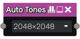

Auto Tones node
~~~~~~~~~~~~~~~

The **Auto Tones** node finds the minimum and maximum values in the input texture and tone maps it to the full 0.0 - 1.0 range.

Inputs
++++++

The **Auto Tones** node requires a greyscale input texture.

Outputs
+++++++

The **Auto Tones** node provides a single greyscale texture.

Parameters
++++++++++

* The *Size* of the buffers used to find the mininum and maximum values for the input image.
  If the input has small details a higher resolution buffer might be needed to capture precise
  min and max values. 

Note: The output itself will not be buffered.
