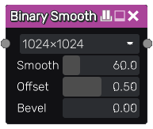

Binary Smooth node
~~~~~~~~~~~~~~~~~~

The **Binary Smooth** node smoothes the shape of a mask.

Inputs
++++++

The **Binary Smooth** node accepts a grayscale mask input to be smoothed.

Outputs
+++++++

The **Binary Smooth** node outputs the result of the smoothing operation.

Parameters
++++++++++

The **Binary Smooth** node has four parameters:

* The *resolution* used for the blur effect. Note the output is not limited to this resolution.

* The *smooth* parameter defines how much the mask will be smoothed.

* The *offset* can be modified to expand or contract the smoothed shape.

* The *bevel* parameter controls the width of the edge for a bevel effect. Note this bevel will not be linear.

Example images
++++++++++++++

