Blend node
~~~~~~~~~~

The **Blend** node blends two or more inputs using an optional opacity. It performs a blend operation
defined by the blend mode between the inputs, and mixes the result with the background input
using the opacity (defined by the *opacity* parameter multiplied by the greyscale input).

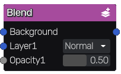

Inputs
++++++

The **Blend** node accepts three or more inputs:

* The first input is the background layer.

* The second input is the first layer.

* The third input is an optional mask that will be multiplied by the
  opacity parameter for the first layer.

This node is variadic, and more layers and associated masks can be added.

Outputs
+++++++

The **Blend** node outputs the result of the blend operation.

Parameters
++++++++++

The **Blend** node has two or more parameters:

* The *blend mode*, that can be one of the following: *Normal*, *Dissolve*, *Multiply*, *Screen*,
  *Overlay*, *Hard Light*, *Soft Light*, *Linear Light*, *Vivid Light*, *Pin Light*, *Burn*, *Dodge*,
  *Lighten*, *Darken*, *Difference*, *Additive*, *AddSub*, *Hard Mix*, *Exclusion*.

* The *opacity* is used when mixing the result of the blend operation with the background input
  when the corresponding input is not connected. When connected, the opacity channel is
  multiplied with that parameter.

Both parameters are repeated for each additional layer.

Blending modes
++++++++++++++

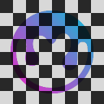

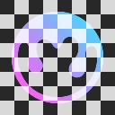

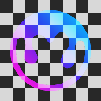

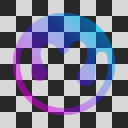

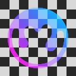

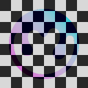

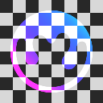

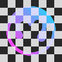

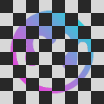

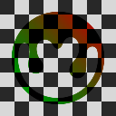

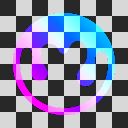

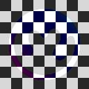

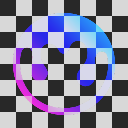

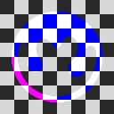

.. |blend_exclusion| image:: images/blend_exclusion.png

+-----------------------+-------------------------------+-------------------------------------------------------------------------------------------------------------------------------+
| Blend mode            | Example                       | Description                                                                                                                   |
+=======================+===============================+===============================================================================================================================+
| Normal                | |blend_normal|                | This is the default blend mode. It simply displays the top layer over the bottom layer without any blending                   |
+-----------------------+-------------------------------+-------------------------------------------------------------------------------------------------------------------------------+
| Dissolve              | |blend_dissolve|              | This blend mode randomly replaces the pixels of the top layer with the pixels of the bottom layer                             |
+-----------------------+-------------------------------+-------------------------------------------------------------------------------------------------------------------------------+
| Multiply              | |blend_multiply|              | This blend mode multiplies the colors of the two layers, resulting in a darker image                                          |
+-----------------------+-------------------------------+-------------------------------------------------------------------------------------------------------------------------------+
| Screen                | |blend_screen|                | This blend mode multiplies the inverse of the colors of the two layers, resulting in a lighter image                          |
+-----------------------+-------------------------------+-------------------------------------------------------------------------------------------------------------------------------+
| Overlay               | |blend_overlay|               | This blend mode multiplies the darker colors and screens the lighter colors. It increases the contrast of the image           |
+-----------------------+-------------------------------+-------------------------------------------------------------------------------------------------------------------------------+
| Hard Light            | |blend_hard_light|            | This blend mode is similar to Overlay, but it is more intense                                                                 |
+-----------------------+-------------------------------+-------------------------------------------------------------------------------------------------------------------------------+
| Soft Light            | |blend_soft_light|            | This blend mode multiplies the darker colors and screens the lighter colors, but it is less intense than Overlay              |
+-----------------------+-------------------------------+-------------------------------------------------------------------------------------------------------------------------------+
| Burn                  | |blend_burn|                  | This blend mode darkens the bottom layer to reflect the top layer. It increases the contrast between the two layers           |
+-----------------------+-------------------------------+-------------------------------------------------------------------------------------------------------------------------------+
| Dodge                 | |blend_dodge|                 | This blend mode lightens the bottom layer to reflect the top layer. It decreases the contrast between the two layers          |
+-----------------------+-------------------------------+-------------------------------------------------------------------------------------------------------------------------------+
| Lighten               | |blend_lighten|               | This blend mode compares the colors of the two layers and keeps the lighter of the two colors                                 |
+-----------------------+-------------------------------+-------------------------------------------------------------------------------------------------------------------------------+
| Darken                | |blend_darken|                | This blend mode compares the colors of the two layers and keeps the darker of the two colors                                  |
+-----------------------+-------------------------------+-------------------------------------------------------------------------------------------------------------------------------+
| Difference            | |blend_difference|            | This blend mode substracts the color of the two layers                                                                        |
+-----------------------+-------------------------------+-------------------------------------------------------------------------------------------------------------------------------+
| Additive              | |blend_additive|              | This blend mode adds the color of the two layers                                                                              |
+-----------------------+-------------------------------+-------------------------------------------------------------------------------------------------------------------------------+
| AddSub                | |blend_addsub|                | This blend mode adds or substract the foreground layer depending on its luminosity                                            |
+-----------------------+-------------------------------+-------------------------------------------------------------------------------------------------------------------------------+
| Linear Light          | |blend_linear_light|          | This blend mode is a combination of Linear Dodge and Linear Burn                                                              |
+-----------------------+-------------------------------+-------------------------------------------------------------------------------------------------------------------------------+
| Vivid Light           | |blend_vivid_light|           | This blend mode is similar to Color Dodge and Color Burn, but it is more intense                                              |
+-----------------------+-------------------------------+-------------------------------------------------------------------------------------------------------------------------------+
| Pin Light             | |blend_pin_light|             | This blend mode replaces colors of the bottom layer with those of the top layer depending on the luminosity of the top layer  |
+-----------------------+-------------------------------+-------------------------------------------------------------------------------------------------------------------------------+
| Hard Mix              | |blend_hard_mix|              | This blend mode multiplies the colors of the two layers, and maps the resulting color to the nearest primary color            |
+-----------------------+-------------------------------+-------------------------------------------------------------------------------------------------------------------------------+
| Exclusion             | |blend_exclusion|             | This blend mode is similar to Difference, but it is less intense                                                              |
+-----------------------+-------------------------------+-------------------------------------------------------------------------------------------------------------------------------+

Notes
+++++

The *opacity* input will be considered (and implicitly converted to) greyscale if it is a color texture.

Example images
++++++++++++++

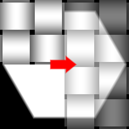
