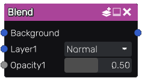

Blend node
~~~~~~~~~~

The **Blend** node blends two or more inputs using an optional opacity. It performs a blend operation
defined by the blend mode between the inputs, and mixes the result with the background input
using the opacity (defined by the *opacity* parameter, or the optional greyscale input).

Inputs
++++++

The **Blend** node accepts three or more inputs:

* The first input is the background layer.

* The second input is the first layer.

* The third input is an optional mask that will be use instead of the
  opacity parameter for the first layer.

This node is variadic, and more layers and associated masks can be added.

Outputs
+++++++

The **Blend** node outputs the result of the blend operation.

Parameters
++++++++++

The **Blend** node has two or more parameters:

* The *blend mode*, that can be one of the following: *Normal*, *Dissolve*, *Multiply*, *Screen*,
  *Overlay*, *Hard Light*, *Soft Light*, *Burn*, *Dodge*, *Lighten*, *Darken*, *Difference*,
  *Additive*, *AddSub*.

* The *opacity* used when mixing the result of the blend operation with the background input
  when the corresponding input is not connected. When connected, the opacity channel is
  multiplied with that parameter.

Both parameters are repeated for each additional layer.

Notes
+++++

The *opacity* input will be considered (and implicitly converted to) greyscale if it is a color texture.

Example images
++++++++++++++

