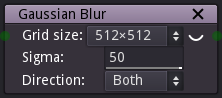

Blur node
~~~~~~~~~

The **Blur** node applies a Gaussian blur algorithm to its input.

Inputs
++++++

The **Blur** node has a single input.

Outputs
+++++++

The **Blur** node outputs the result of the blur operation.

Parameters
++++++++++

The **Blur** node has three parameters:

* The *grid size* defines the size of the output image.

* The *direction* specifies if the blur algorithm is applied horizontally, vertically or both.

* The *sigma* parameter defines how smooth the output will be.

Notes
+++++

This node outputs an image that has a fixed size.

Example images
++++++++++++++

.. image:: images/node_blur_samples.png
	:align: center
