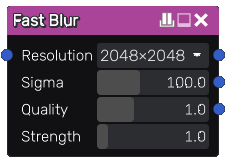

Fast Blur node
~~~~~~~~~~~~~~

The **Fast Blur** node applies an approximated Gaussian blur algorithm to its input.

Inputs
++++++

The **Fast Blur** node accepts an RGBA input to be blurred and an optional blur mask
that defines the intensity of the blur effect.

Outputs
+++++++

The **Fast Blur** node has three outputs:

* The first output is the result of the blur operation.

* The second output is the high frequency details removed by the blur.
  In other words, the first output subtracted from the original image.
  Note that all channels including alpha will be centered at 0,
  so this will need to be connected to a SwapChannels node to be seen in previews.

* The third output is the original image sharpened.
  In other words, this is the second output added back to the original image.

Parameters
++++++++++

The **Fast Blur** node has four parameters:

* The *resolution* defines the size of the output image.

* The *sigma* parameter defines how smooth the output will be.

* The *quality* can be modified to choose between nicer result and rendering time.

* The *strength* parameter is a multiplier for the high-pass and sharpened outputs.
  It is unused for the blur output.

Notes
+++++

This node outputs an image that has a fixed size.

Example images
++++++++++++++

.. image:: images/node_blur_samples.png
	:align: center
