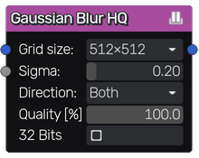
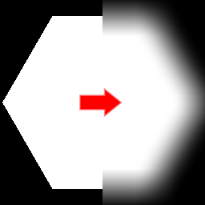

Blur HQ node
~~~~~~~~~~~~

The **Blur HQ** node applies a high-quality Gaussian blur algorithm to its input.

Inputs
++++++

The **Blur HQ** node accepts an RGBA input to be blurred and an optional blur mask
that defines the intensity of the blur effect.

Outputs
+++++++

The **Blur HQ** node outputs the result of the blur operation.

Parameters
++++++++++

The **Blur HQ** node has five parameters:

* The *Grid Size* defines the size of the output image.

* The *Sigma* parameter defines how smooth the output will be.

* The *Direction* specifies if the blur algorithm is applied horizontally, vertically or both.

* The *Quality* specifies the quality the blur algorithm.

* whether *32 Bits* buffer(s) are used to store input/outputs.
  Reduces banding artifacts but could result in higher video
  memory usage.

Notes
+++++

This node outputs an image that has a fixed size.

Example images
++++++++++++++

