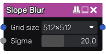

Slope Blur node
~~~~~~~~~~~~~~~~~~~~~

The **Slope Blur** node applies a blur algorithm to its first input
in a direction given by a heightmap.

Inputs
++++++

The **Slope Blur** node has an input image to be blurred and a heightmap
image used to defined the direction of the blur effect.

Outputs
+++++++

The **Slope Blur** node outputs the result of the blur operation.

Parameters
++++++++++

The **Slope Blur** node has three parameters:

* The *grid size* defines the size of the output image.

* The *sigma* parameter defines how blurred the output will be.

Notes
+++++

This node outputs an image that has a fixed size.

Example images
++++++++++++++

