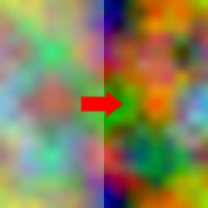

BrightnessContrast node
~~~~~~~~~~~~~~~~~~~~~~~

The **BrightnessContrast** node adjusts the brightness and contrast of the input image.

.. image:: images/node_brightness_contrast.png
	:align: center

Inputs
++++++

The **BrightnessContrast** node accepts an RGBA input texture.

Outputs
+++++++

The **BrightnessContrast** node provides a single RGBA texture.

Parameters
++++++++++

The **BrightnessContrast** node has the following parameters:

* *Brightness* defines how brightness is affected.

* *Contrast* defines how the contrast is affected.

Example images
++++++++++++++

