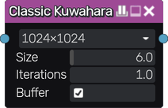

Classic Kuwahara node
~~~~~~~~~~~~~~~~~~~~~

The **Classic Kuwahara** node applies a simple edge-preserving smoothing filter to its input.

Inputs
++++++

The **Classic Kuwahara** node has a single input.

Outputs
+++++++

The **Classic Kuwahara** node outputs the result of the smoothing filter.

Parameters
++++++++++

The **Classic Kuwahara** node accepts the following parameters:

* **Resolution** used to sample the input.

* **Size** of the filter.

* Whether a **Buffer** is used to sample the input before the filter.

Example images
++++++++++++++

