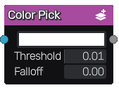

Color Pick node
~~~~~~~~~~~~~~~

The **Color Pick** node creates masks from a color input and color parameters.

This node is variadic and can generate several masks from the same image.

Inputs
++++++

The **Color Pick** node has a single color input.

Outputs
+++++++

The **Color Pick** node outputs grayscale images.

Parameters
++++++++++

The **Color Pick** node accepts the following parameters:

* **Color**, the color to match when creating the mask for each outputs

* **Threshold**, the tolerance used when creating the mask

* **Falloff**, the slope used when creating the mask
