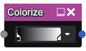

Colorize node
~~~~~~~~~~~~~

The **Colorize** node applies a user-defined gradient to a grayscale image: black pixels
will be colored with the leftmost color of the gradient and white pixels will take
the rightmost color.

Inputs
++++++

The **Colorize** node requires a grayscale input texture.

Outputs
+++++++

The **Colorize** node provides a single color texture.

Parameters
++++++++++

The **Colorize** node has a single parameter that defines the gradient to be applied to
the input image.

Notes
+++++

The input will be considered (and implicitly converted to) grayscale if it is a color texture.

Pasting a text containing HTML colors (in the #1234ab syntax) into a graph editor will create a Colorize
node that contains all specified colors.

Example images
++++++++++++++

