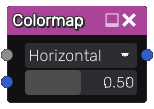

Colormap node
~~~~~~~~~~~~~

The **Colormap** node colorizes a greyscale image using a range of colors
produced by sampling a single row or column from another image.

By default, the node samples colors horizontally along the center of the
colormap image. Black pixels in the greyscale image will become the color at
the left edge of this row, white pixels the color at the right edge, and grey
pixels the colors in between.

Inputs
++++++

The **Colormap** node accepts 2 inputs:

* *Input*, the greyscale texture to be colorized

* *Colormap*, the RGBA texture to sample colors from

Outputs
+++++++

The **Colormap** node provides a single color texture as output.

Parameters
++++++++++

The **Colormap** node has the following parameters:

* *Axis* controls whether to sample the *Colormap* texture horizontally or vertically

* *Offset* controls which row or column in the *Colormap* will be sampled

Example images
++++++++++++++

.. image:: images/node_colormap_samples.png
	:align: center
