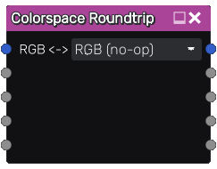

Colorspace Roundtrip node
~~~~~~~~~~~~~~~~~~~~~~~~~

The **Colorspace Roundtrip** node converts its input to another colorspace,
applies a "lambda subgraph" to individual channels in that colorspace,
and converts it back to RGB.

A common pattern when working with non-RGB colorspaces is to convert an RGB input to the desired colorspace,
apply some transformations to it within that colorspace, and finally convert it back to RGB.
The **Colorspace Roundtrip** node streamlines this process by encapsulating it into a single node.

Inputs
++++++

The **Colorspace Roundtrip** node accepts an RGBA input.

Outputs
+++++++

The **Colorspace Roundtrip** node provides an RGBA output.

Lambda I/O
++++++++++

The bottom four outputs and inputs of the **Colorspace Roundtrip** node correspond to
the three channels of the working colorspace along with the alpha channel.
Outputs should be connected to a "lambda subgraph" that applies the desired transformation in the working colorspace,
which should then be connected back to the inputs for conversion back to RGB.

By default, unconnected inputs will receive data from the corresponding output unchanged.
This means that only the channels that require modification need to be connected.

Parameters
++++++++++

The **Colorspace Roundtrip** node has a single parameter to choose the working colorspace.
The alpha channel will be passed through unchanged in all cases.

* *RGB*: Pass through the input unchanged.
  This is useful when channels need to be individually separated for transformation but a colorspace conversion is not needed.

* *HSV*: Artist-friendly colorspace with intuitive behavior.
  Consists of a circular Hue channel, a linear Saturation channel, and a linear Value channel.

* *YUV*: Compression-friendly colorspace with a very accurate luminance model.
  Consists of a linear Luma (brightness) channel and two Chroma (blueness and redness) channels.

Example usage
+++++++++++++

* Desaturate (replace Saturation channel of HSV with 0)

* Swap Red and Green channels

* Reduce brighness (multiply Value channel of HSV by 0.5)

