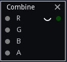

Combine node
~~~~~~~~~~~~

The **Combine** node combines four greyscale inputs into an RGBA output texture.

Inputs
++++++

The **Combine** node has 4 inputs, one for each (red, green, blue and alpha) channel.

Outputs
+++++++

The **Combine** node outputs an RGBA texture.
