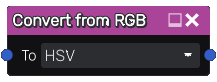

Convert from/to RGB nodes
~~~~~~~~~~~~~~~~~~~~~~~~~

The **Convert from RGB** and **Convert to RGB** nodes converts between RGB and another specified colorspace.
The alpha channel will pass through unaffected.

Inputs
++++++

The **Convert from RGB** node accepts an RGBA input.

The **Convert to RGB** node accepts an input in the specified colorspace.

Outputs
+++++++

The **Convert from RGB** node provides an output in the specified colorspace.

The **Convert to RGB** node provides an RGBA output.

Parameters
++++++++++

Both nodes have a single parameter to choose the colorspace being converted to/from.
The alpha channel will be passed through unchanged in all cases.

* *RGB*: Pass through the input unchanged.

* *HSV*: Artist-friendly colorspace with intuitive behavior.
  Consists of a circular Hue channel, a linear Saturation channel, and a linear Value channel.

* *YUV*: Compression-friendly colorspace with a very accurate luminance model.
  Consists of a linear Luma (brightness) channel and two Chroma (blueness and redness) channels.
