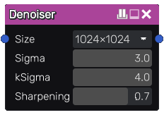

Denoiser node
.................

The **Denoiser** node performs fast spatial deNoise filter, with circular gaussian kernel.

Inputs
++++++

The **Denoiser** node accepts one input:

* The *Source* inputs is the image to be denoised.

Outputs
+++++++

The **Denoiser** node outputs the denoised image.

Parameters
::::::::::

The **Denoiser** node has the following parameters:

* the *Size* determines the resolution of the denoiser

* the Standard Deviation *Sigma* radius

* the *kSigma* is the K factor sigma coefficient:
    * kSigma = 1*sigma cover 68% of data
    * kSigma = 2*sigma cover 95% of data - but there are over 3 times  more points to compute
    * kSigma = 3*sigma cover 99.7% of data - but needs more than double the calculations of 2*sigma

* the edge *Sharpening* threshold

Example images
::::::::::::::

